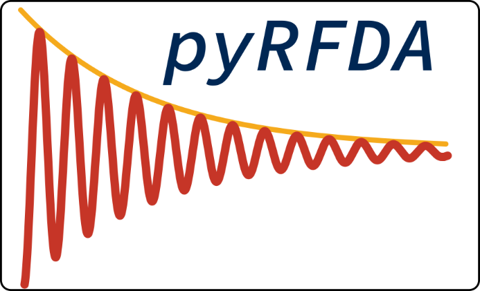

# About The the Project
Resonant frequency damping analysis is a simple method of determining the elastic modulus, shear modulus and damping of uncharacterized materials. A rectangular bar or cylinder ssample of known dimensions is suspended at is nodes (non vibrating points), and tapped sharply with a mallet causing it to resonate. The resonant frequency is related to the elastic modulus (or shear modulus depending on how it is suspended), and the decay rate of the sound is related to the damping.

RFDA's simplicity makes it ideal for low cost analysis of new 3D printed metal alloys. Unfortunately, commercial solutions are extremely expensive. pyRFDA aims to create a mostly plug and play project in Python for conducting RFDA for which a simple apparatus can be constructed from cheap materials with few tools.
