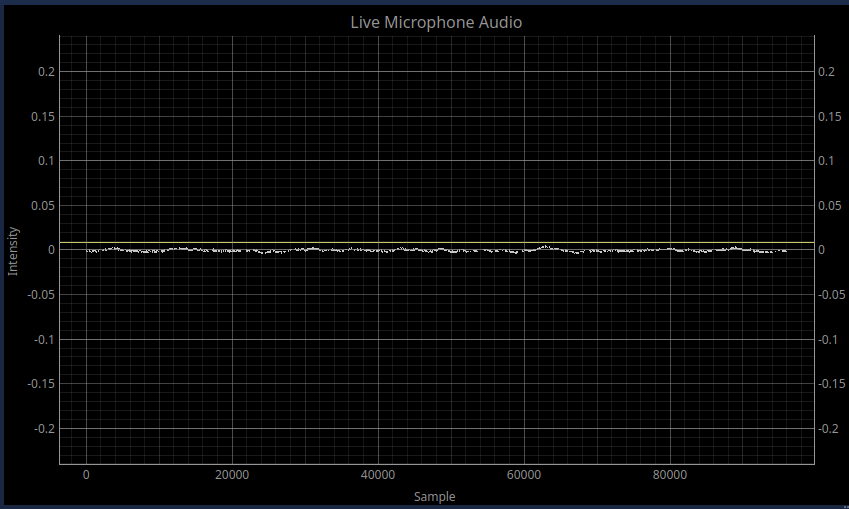

# About The the Project
Resonant frequency damping analysis is a simple method of determining the elastic modulus, shear modulus and damping of uncharacterized materials. A rectangular bar or cylinder sample of known dimensions is suspended at its nodes (non vibrating points), and tapped sharply with a mallet causing it to resonate. The resonant frequency is related to the elastic modulus (or shear modulus depending on how it is suspended), and the decay rate of the sound is related to the damping.

RFDA's simplicity makes it ideal for low cost analysis of new 3D printed metal alloys. Unfortunately, commercial solutions are extremely expensive. pyRFDA aims to create a mostly plug and play project in Python for conducting RFDA for which a simple apparatus can be constructed from cheap materials with few tools.

# Installation
Pre-built versions are available for Linux and Windows in the [releases tab](https://github.com/jjderooy/pyRFDA/releases). If you would like to install manually, follow the instructions below. You will need a working python install.

## Linux
First, navigate the the folder you would like to install to, open a terminal there and clone the repository:
```
git clone https://github.com/jjderooy/pyRFDA.git
```

Next, enter that directory and create a virtual environment there:
```
cd pyRFDA
python -m venv .venv/
```
Activate the venv:
```
source .venv/bin/activate
```

Install the required libraries using pip:
```
pip install -r requirements.txt
```

From now on, to use pyRFDA, open a terminal in `/src` and run:
```
source ../.venv/bin/activate
python main.py
```

## Windows
First, navigate the the folder you would like to install to, open powershell there and clone the repository. Alternatively if you don't have git installed, download using the *<> Code* dropdown menu and select *Download ZIP*.

```
git clone https://github.com/jjderooy/pyRFDA.git
```
Next, enter that directory and create a virtual environment in a directory called `.venv` there. You will need the *virtualenv* package if not installed already: `pip install virtualenv`.
```
cd pyRFDA
python -m venv .venv
```

Activate the venv:
```
.venv\Scripts\activate
```

Install the required libraries using pip:
```
pip install -r requirements.txt
```

From now on, to use pyRFDA, open a terminal in `\src` and run:
```
..\.venv\Scripts\activate
python main.py
```

# Usage
pyRFDA Companion is designed to be easy to use, although is fairly rigid in its workflow to simplify its programming. To begin, start the ui and enter the parameters of your sample you wish to test:


Click *Create Sample*. This will lock in your values to prevent accidentally changing them, so make sure you've entered everything correctly! If you've made a mistake, reopen the program and start over. If estimated values for elastic and shear modulus were specified, the expected resonant frequencies are computed and displayed in the Computed Outputs section. This can be helpful later on if multiple harmonics appear in the next step. Pay attention to the *Status Log* for any warnings about the geometry.


The *First Node* and *Node Space* values are for setting up the apparatus' support wires to support the sample. The first node is the distance from the end of the sample, that the first support should be placed, and the node space is the distance from that wire to the next.


Now by default, the program selects the default input device for the recording microphone which may or may not be desirable. Use the *Source* tab to change it if necessary.


Next set up your microphone over a node and adjust the trigger threshold using the horizontal yellow line in the Live Microphone Audio plot to be just above the noise floor.



Click *Record* and gently tap the sample at an antinode to start it resonating. pyRFDA will automatically start recording when the incoming audio is above the trigger, and stop when it is below for a minimum period of time. After recording, the FFT of the audio is displayed. Ideally it will contain one large peak, but other harmonics may be present.


Adjust the vertical yellow line on the FFT plot to be on top of the peak of interest. Within a small radius, this is where pyRFDA will search for the maximum value and it's corresponding frequency. With the search region now set, record a new run. This time, realistic results for material properties will be produced because pyRFDA has the correct resonant frequency to calculate with.


Once happy with measurement, click *Save* and select the folder you wish to save all data to. pyRFDA will automatically create a folder using the date and name of the sample so no need to create one. More measurements can be completed in this same manner, by clicking *Record*, then *Save* if the measurement was sucessful. If you accidentally save a run, select it in the *Runs* table and delete it with the *Delete Selected Run(s)* button in the bottom right hand corner.


Each time you complete a measurement run, the recorded audio (as .wav and .csv) and graphs are exported to the save location. A PDF report is also generated as a summary of the measurements collected on that sample.

To start measurements on a new sample, close the program and reopen it.

# Additional Notes
Helpful advice is listed below for setting up an RFDA measurement system, and provides insight on how the system works.
## Microphone Selection
A fairly directional microphone with an internal ADC positioned just over an antinode is ideal. The internal ADC is convenient because data acquisition is then independent of the computer the microphone is connected to. Good results have been obtained with the reasonably inexpensive UMIK-1 from miniDSP.
Be aware essentially all consumer microphones have a maximum frequency response of 20 kHz. Any frequencies above this value will not be measurable. 

## Geometry Restrictions
RFDA relies on analytical models that make assumptions about the geometry of the sample. For rectangular or rod geometry, literature (based on ASTM recommendation) indicates length/thickness (or length/diameter) must be greater than 20. However, according to National Physical Laboratory (NPL) *Good measurement practice Guide No. 98* by JD Lord and R Morrell, even ratios as small as 5 give deviate only by 1%. For samples and especially small ones, this is eclisped by errors in measurement of the physical dimensions, which in the case of thickness or diameter vary results by the third power.

## Envelope Fitting
A resonating sample's amplitiude of vibration decays exponentially with each oscillation due to internal friction in the material. To calculate this exponential decay, a curve must be fitted to the recorded waveform. In order to accurately do this, pyRFDA first computes the envelope of the waveform using standard calculus to find all local maximums. Next, it subdivides the local maximums into groups of 20, and selects the largest local max of each group. This is to avoid including local maximums that are well below the trend of the envelope which typically appear at the start of the waveform when the signal is particularly noisy. The remaining maximums are what the exponential function is fitted to.
